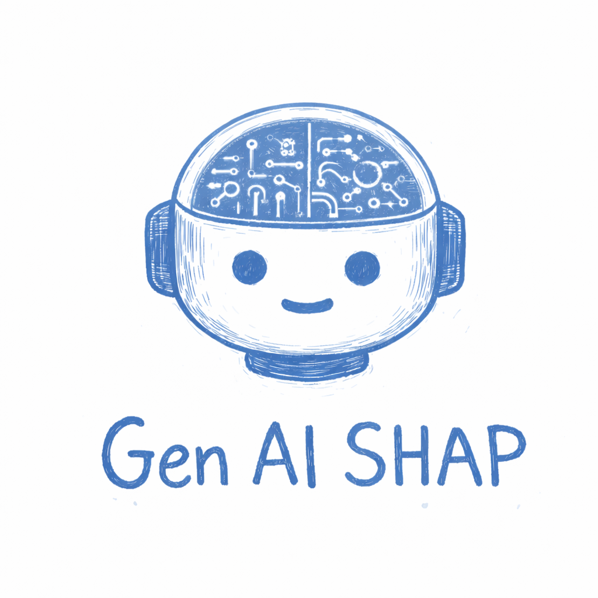
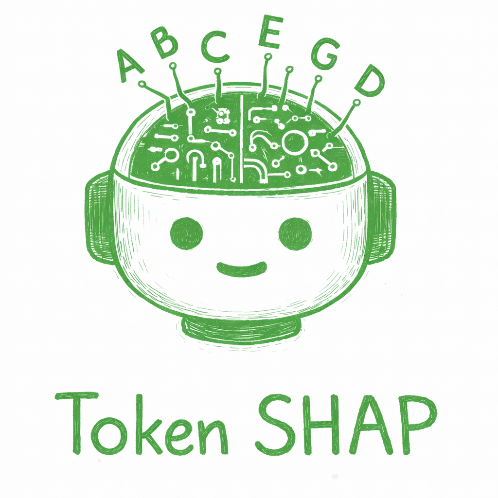
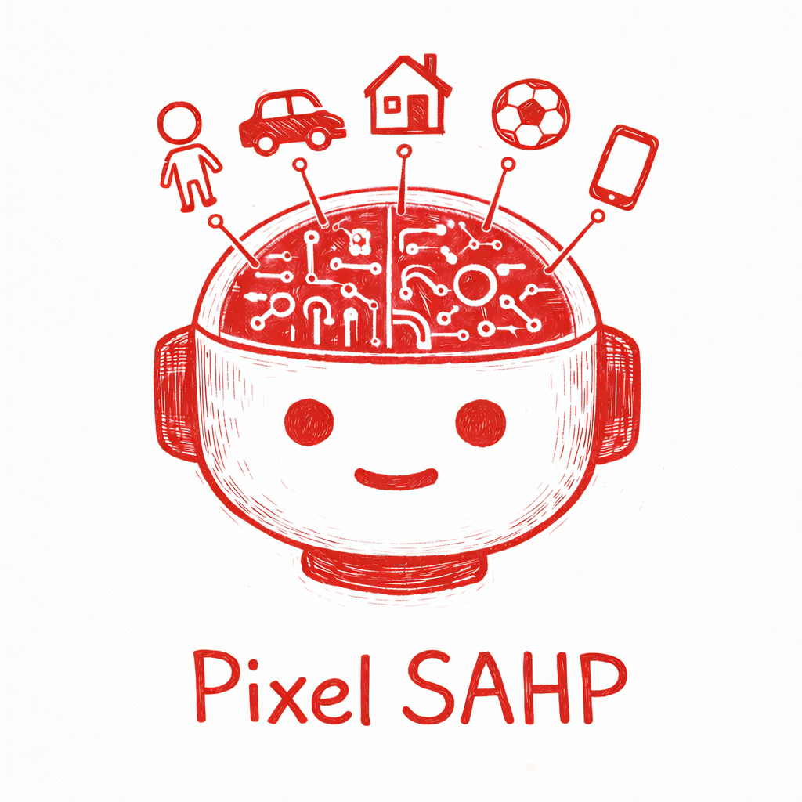
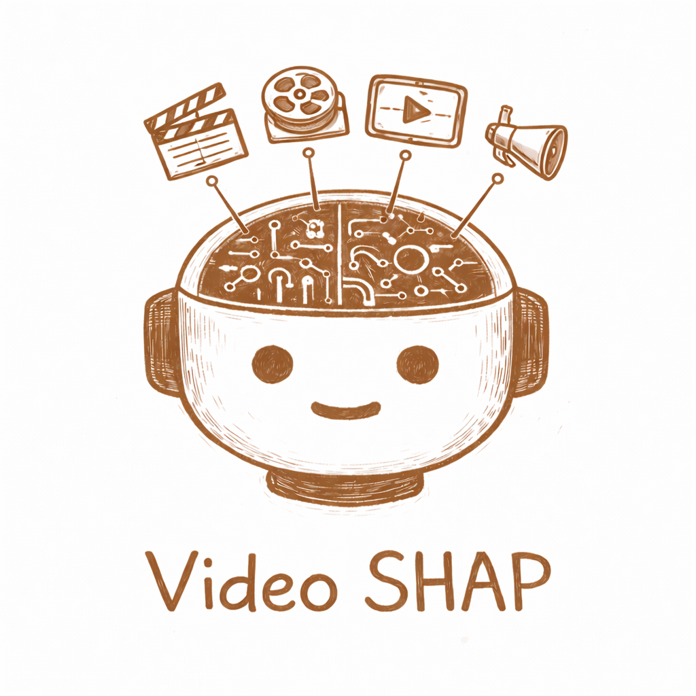
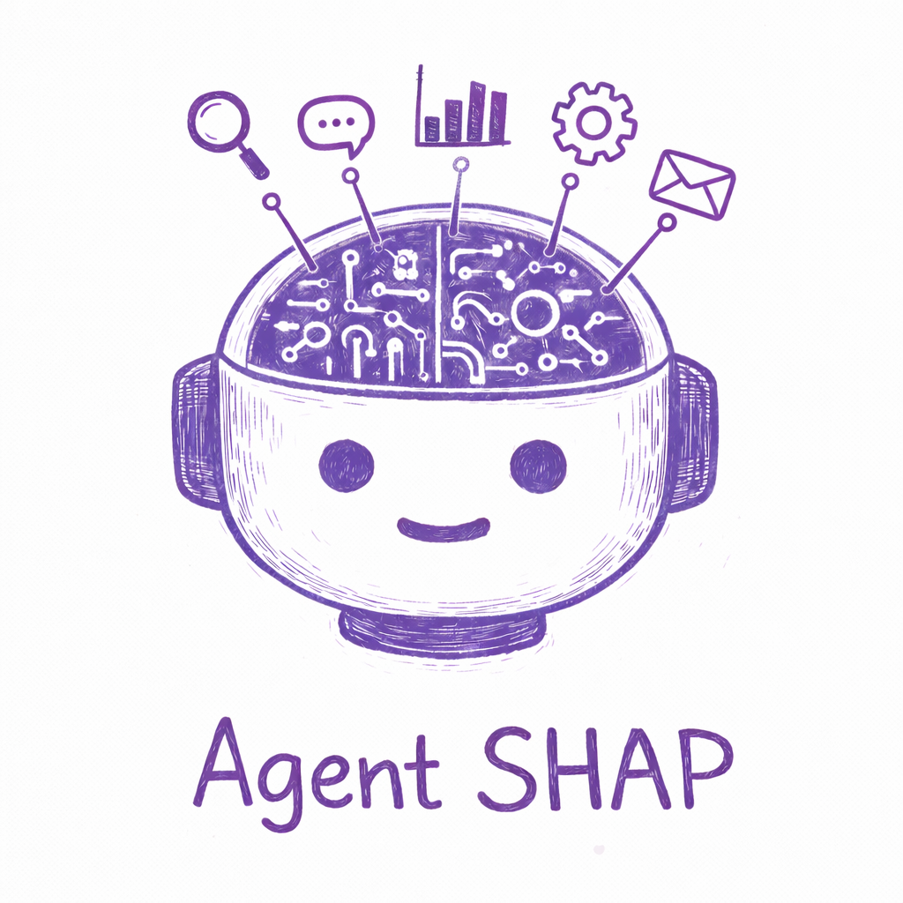

<p align="center">
  
</p>

<h1 align="center">GenAI-SHAP</h1>
<h3 align="center">Unified Explainability for Generative AI</h3>

<p align="center">
A framework for interpreting modern AI systems using Monte Carlo Shapley value estimation.<br/>
Model-agnostic explainability across language models, vision-language models, video understanding, and autonomous agents.
</p>

---

## Overview

GenAI-SHAP provides a unified theoretical foundation for explaining generative AI systems. All methods share the same core principle: **Shapley values from cooperative game theory**. By treating input components (tokens, objects, tools, tracked entities) as players in a cooperative game, we rigorously quantify each component's contribution to the model's output.

| Method | Domain | Input Components | Publication |
|--------|--------|------------------|-------------|
| [**TokenSHAP**](#-tokenshap) | Large Language Models | Text tokens | [arXiv:2407.10114](https://arxiv.org/abs/2407.10114) |
| [**PixelSHAP**](#%EF%B8%8F-pixelshap) | Vision-Language Models | Visual objects | [arXiv:2503.06670](https://arxiv.org/abs/2503.06670) |
| [**VideoSHAP**](#-videoshap) | Video Understanding | Tracked objects | Coming soon |
| [**AgentSHAP**](#-agentshap) | LLM Agents | Tools | [arXiv:2512.12597](https://arxiv.org/abs/2512.12597) |

### Why Shapley Values?

Shapley values provide the **unique** attribution method satisfying four axiomatic properties:

- **Efficiency** — Attributions sum to the total value
- **Symmetry** — Equal contributors receive equal attribution
- **Null player** — Non-contributors receive zero attribution
- **Linearity** — Attributions combine predictably across games

These guarantees make Shapley-based explanations theoretically grounded and practically meaningful.

---

## 🔍 TokenSHAP

<p align="center">
  
</p>

TokenSHAP provides fine-grained interpretability for language models using Monte Carlo Shapley value estimation over input tokens.


### Key Features
- Estimates token importance using cooperative game theory
- Highlights which parts of a prompt contributed most to the generated response
- Compatible with both local and API-based LLMs


### Example Usage
```python
from token_shap import *

model = LocalModel("meta-llama/Llama-3.2-3B-Instruct")
splitter = StringSplitter()
token_shap = TokenSHAP(model, splitter)

prompt = "Why is the sky blue?"
df = token_shap.analyze(prompt, sampling_ratio=0.0, print_highlight_text=True)
```

For API-based models:
```python
api_model = OllamaModel(model_name="llama3.2:3b", api_url="http://localhost:11434")
token_shap_api = TokenSHAP(api_model, StringSplitter())
df = token_shap_api.analyze("Why is the sky blue?", sampling_ratio=0.0)
```


See [`notebooks/TokenShap Examples.ipynb`](notebooks/TokenShap%20Examples.ipynb) for complete examples.

---

## 🖼️ PixelSHAP

<p align="center">
  
</p>

PixelSHAP is an object-level interpretability framework for **text-generating vision-language models**. It attributes Shapley values to visual objects based on their contribution to the model's response.


### What Makes PixelSHAP Unique?
- **Model-agnostic**: Only requires input-output access (no internal model introspection needed)
- **Object-level attribution**: Uses segmentation models like SAM + Grounding DINO
- **Efficient**: Avoids pixel-level perturbations by masking full objects
- **Supports any black-box VLM**: Works with commercial models like GPT-4o and open-source models like LLaVA

### Architecture


### Example Usage
```python
pixel_shap = PixelSHAP(
    model=vlm,
    segmentation_model=segmentation_model,
    manipulator=manipulator,
    vectorizer=openai_embedding,
    debug=False,
    temp_dir='example_temp',
)

results_df, shapley_values = pixel_shap.analyze(
    image_path=image_path,
    prompt="Tell me what's strange about the picture?",
    sampling_ratio=0.5,
    max_combinations=20,
    cleanup_temp_files=True
)

pixel_shap.visualize(
    background_opacity=0.5,
    show_original_side_by_side=True,
    show_labels=False,
    show_model_output=True
)
```


See [`notebooks/PixelSHAP Examples.ipynb`](notebooks/PixelSHAP%20Examples.ipynb) for complete examples.

---

## 🎬 VideoSHAP

<p align="center">
  
</p>

VideoSHAP extends the framework to video content, tracking objects across frames and computing importance scores that reflect each object's contribution to the VLM's temporal reasoning.

### Key Features
- SAM3-based object tracking with text-prompted detection
- Support for native video models (Gemini) and frame-sequence approaches (GPT-4o)
- Temporal importance profiles showing how relevance evolves
- Video output with heatmap overlays
- Adaptive frame sampling with target FPS control

### Example Results

<table>
<tr>
<td align="center"><b>Birthday Party Analysis</b></td>
<td align="center"><b>Cats Interaction</b></td>
</tr>
<tr>
<td></td>
<td></td>
</tr>
</table>

<table>
<tr>
<td align="center"><b>Scene Understanding Q1</b></td>
<td align="center"><b>Scene Understanding Q2</b></td>
<td align="center"><b>Scene Understanding Q3</b></td>
</tr>
<tr>
<td></td>
<td></td>
<td></td>
</tr>
</table>

### Example Usage
```python
from token_shap import (
    VideoSHAP,
    SAM3VideoSegmentationModel,
    VideoBlurManipulator,
    GeminiVideoModel
)
from token_shap.base import HuggingFaceEmbeddings

# Initialize tracking and VLM
tracker = SAM3VideoSegmentationModel(model_name="facebook/sam3", device="cuda")
vlm = GeminiVideoModel(model_name="gemini-2.0-flash", api_key="...")
manipulator = VideoBlurManipulator(blur_radius=51)
embeddings = HuggingFaceEmbeddings()

# Create analyzer
video_shap = VideoSHAP(
    model=vlm,
    segmentation_model=tracker,
    manipulator=manipulator,
    vectorizer=embeddings
)

# Analyze video
results_df, shapley_values = video_shap.analyze(
    video_path="video.mp4",
    prompt="What is happening in this scene?",
    text_prompts=["person", "car", "object"],
    target_fps=8,
    sampling_ratio=0.3
)

# Generate visualization
video_shap.visualize(output_path="attributed_video.mp4")
```

See [`notebooks/VideoSHAP Examples.ipynb`](notebooks/VideoSHAP%20Examples.ipynb) for complete examples.

---

## 🤖 AgentSHAP

<p align="center">
  
</p>

AgentSHAP is an **explainability framework for AI agents**. It answers the question: *"Which tools did the agent rely on to produce its response?"* by computing Shapley values for each tool in the agent's toolkit.


### Key Features
- **Agent explainability**: Understand why an agent produced a specific response
- **Tool attribution**: Quantify each tool's contribution to response quality
- **Model-agnostic**: Works with any LLM that supports function calling (OpenAI, Anthropic, etc.)
- **Visual analysis**: Red-to-blue coloring shows tool importance (like TokenSHAP)


### Example Usage
```python
from token_shap import AgentSHAP, OpenAIModel, OpenAIEmbeddings, create_function_tool

# Create model and vectorizer (embeddings for semantic similarity)
model = OpenAIModel(model_name="gpt-4o-mini", api_key="...")
vectorizer = OpenAIEmbeddings(api_key="...", model="text-embedding-3-large")

# Define tools with bundled executors
weather_tool = create_function_tool(
    name="get_weather",
    description="Get current weather for a city",
    parameters={
        "type": "object",
        "properties": {"city": {"type": "string"}},
        "required": ["city"]
    },
    executor=lambda args: f"Weather in {args['city']}: 72°F, sunny"
)

stock_tool = create_function_tool(
    name="get_stock_price",
    description="Get stock price for a symbol",
    parameters={
        "type": "object",
        "properties": {"symbol": {"type": "string"}},
        "required": ["symbol"]
    },
    executor=lambda args: f"{args['symbol']}: $150.25 (+1.2%)"
)

# Create AgentSHAP and analyze
agent_shap = AgentSHAP(model=model, tools=[weather_tool, stock_tool], vectorizer=vectorizer)
results_df, shapley_values = agent_shap.analyze(
    prompt="What's the weather in NYC and how is AAPL doing?",
    sampling_ratio=0.5
)

# Visualize results
agent_shap.print_colored_tools()      # Console output with colors
agent_shap.plot_tool_importance()     # Bar chart
agent_shap.plot_colored_tools()       # Matplotlib with colorbar
```

### How It Works
AgentSHAP explains agent behavior by measuring the marginal contribution of each tool:

1. **Baseline**: Run agent with all tools to get reference response
2. **Ablation**: Test agent with different tool subsets (some tools removed)
3. **Similarity**: Compare each ablated response to baseline
4. **Attribution**: Compute Shapley values showing each tool's contribution

**Interpreting results**: Tools with high SHAP values were critical for the response; tools with low values had minimal impact. This helps debug agent behavior, optimize tool selection, and understand agent decision-making.

See [`notebooks/AgentSHAP Examples.ipynb`](notebooks/AgentSHAP%20Examples.ipynb) for complete examples.

---

## 🧪 Installation

To get started, clone the repository and install the dependencies:

```bash
git clone https://github.com/ronigold/TokenSHAP.git
cd TokenSHAP
pip install -r requirements.txt
```

### Optional Dependencies

```bash
# For local LLMs
pip install transformers accelerate

# For video processing
pip install imageio[ffmpeg]

# For SAM3 tracking
pip install sam3
```

*Note: PyPI installation is currently disabled.*

---

## 📄 Citation

If you use TokenSHAP, PixelSHAP, VideoSHAP, or AgentSHAP in your research, please cite:

```bibtex
@article{goldshmidt2024tokenshap,
  title={TokenSHAP: Interpreting Large Language Models with Monte Carlo Shapley Value Estimation},
  author={Goldshmidt, Roni and Horovicz, Miriam},
  journal={arXiv preprint arXiv:2407.10114},
  year={2024}
}

@article{goldshmidt2025pixelshap,
  title={Attention, Please! PixelSHAP Reveals What Vision-Language Models Actually Focus On},
  author={Goldshmidt, Roni},
  journal={arXiv preprint arXiv:2503.06670},
  year={2025}
}

@article{goldshmidt2025videoshap,
  title={VideoSHAP: Temporal Object Attribution for Video Understanding},
  author={Goldshmidt, Roni},
  journal={arXiv preprint},
  year={2025}
}

@article{horovicz2025agentshap,
  title={AgentSHAP: Interpreting LLM Agent Tool Importance with Monte Carlo Shapley Value Estimation},
  author={Horovicz, Miriam},
  journal={arXiv preprint arXiv:2512.12597},
  year={2025}
}
```

---

## 👥 Authors

- **Roni Goldshmidt**, Nexar
- **Miriam Horovicz**, Fiverr

For questions or support, contact:
- roni.goldshmidt@getnexar.com
- miriam.horovicz@fiverr.com

---

## 🔧 Contributing

We welcome community contributions! To contribute:
1. Fork the repository
2. Create a branch: `git checkout -b feature/your-feature`
3. Commit your changes: `git commit -am 'Add feature'`
4. Push the branch: `git push origin feature/your-feature`
5. Open a Pull Request

---

## 📂 Repository Structure

```
TokenSHAP/
├── token_shap/
│   ├── token_shap.py      # Token-level attribution for LLMs
│   ├── pixel_shap.py      # Object-level attribution for VLMs
│   ├── video_shap.py      # Temporal object attribution for videos
│   ├── agent_shap.py      # Tool-level attribution for AI agents
│   ├── base.py            # Model abstractions (OpenAI, Gemini, Ollama, etc.)
│   ├── tools.py           # Tool definitions for AgentSHAP
│   ├── image_utils.py     # Segmentation utilities
│   ├── video_utils.py     # Video processing utilities
│   └── visualization.py   # Plotting utilities
├── notebooks/             # Jupyter notebooks with examples
├── experiments/           # Research experiments
├── tests/                 # Test suite
├── data/                  # Images used in documentation
└── images/                # Logos and GIFs
```

---

By combining TokenSHAP, PixelSHAP, VideoSHAP, and AgentSHAP, this library offers full-spectrum interpretability for modern AI systems—from language-only prompts to complex multimodal inputs to agentic tool-calling workflows.
